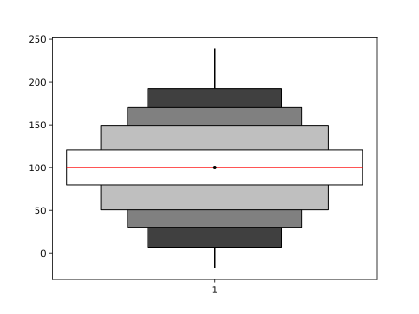

# Extended BoxPlots

Extended box plot are customizable box plots drawn for a set of percentile pairs (c.f. p. 31 in [Harrell Jr (2014)][1]).


## Usage

```py
import numpy as np
import matplotlib.pyplot as plt

from extended_boxplots import compute_extended_boxplot_stats, plot_extended_boxplot

# Create sample normal distribution
dist_norm = np.random.normal(100, 30, 100000)

# Compute extended box plot statistics
boxplot_stats = compute_extended_boxplot_stats(dist_norm)

# Plot the extended box plot
fig, ax = plt.subplots()
plot_extended_boxplot(ax, [boxplot_stats])
fig.savefig('extended_boxplot.svg', dpi=200)
```



## Versioning

This project uses [semantic versioning](https://semver.org/).


## Copyright and licence

Copyright 2018 D. Meyer. Licensed under [MIT](LICENSE.txt).


[1]: http://biostat.mc.vanderbilt.edu/wiki/pub/Main/StatGraphCourse/graphscourse.pdf